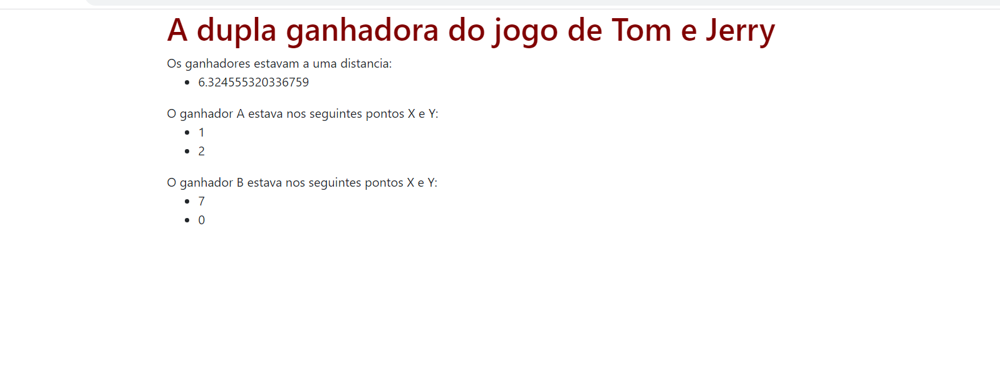

# Jogo da Dupla Próxima

**Número da Lista**: 8 
**Conteúdo da Disciplina**: Dividir e Conquistar 

## Alunos
|Matrícula | Aluno |
| -- | -- |
| 19/0025298  | Bianca Sofia Brasil de Oliveira|
| 19/0026375  | Daniel Vinicius Ribeiro Alves |

## Sobre 
O objetivo do Jogo da dupla próxima de tom e jerry é  fazer os jogadores andarem pelo plano cartesiano até que o juíz diga para parar. Após isso serão inseridas as localizações
de todos os jogadores no plano em nossa plataforma, os dois jogadores que estiverem mais perto no plano ganham 1000000 de reais em dinheiro.

## Screenshot

## Instalação 
**Linguagem**: JavaScript 
Para rodar o projeto localmente, é necessário possuir o node instalado na máquina
Clone o repositório em sua máquina local, navegue até a pasta do JogoDuplaProxima e baixe as dependências com o comando npm install.
Para executar o projeto: node app.js. O projeto roda na porta: localhost:3000

## Uso 
Após executar o comando para rodar e abrir o localhost:3000, o usuário deve inserir as localizações em formato json, exemplo: [{ "x": 1, "y": 2 }, { "x": 54, "y": 12 }, { "x": 45, "y": 45 }, { "x": 7, "y": 0 }] e então apertar em verificar.

